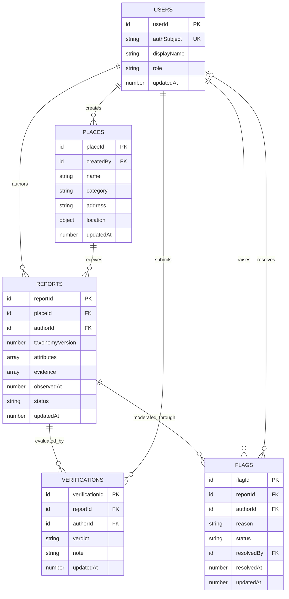

# S0-5 — Entity Model and Accessibility Attribute Taxonomy

## Story

- **Sprint:** Sprint 0
- **Epic:** E1 Foundation & DevOps
- **Estimate:** 3 points
- **Owner:** M1
- **Objective:** Agree and encode the core Convex entity model and a stable accessibility attribute taxonomy before feature work starts.

## Current State

The backend currently declares only the temporary `health` table in `packages/backend/convex/schema.ts`. The `/debug` mobile route and `convex/health.ts` use that table to verify live Convex queries and mutations, so this story must retain it unless the debug feature is deliberately removed in a separate change.

No product entities, accessibility vocabulary, relationship indexes, or report entity documentation exist yet.

## Decisions to Agree Before Implementation

This is the reviewed implementation baseline. M1 and the dependent feature owners must approve it before the schema PR is merged:

1. A **place** is a public location and does not carry one global accessible/not-accessible boolean.
2. A **report** is one author's observation of one place at a point in time.
3. Accessibility is recorded per attribute with `yes`, `no`, `partial`, `unknown`, or `not_applicable`; absence of an attribute means “not assessed,” not “no.”
4. A **verification** confirms or disputes a report. It does not directly mutate the report's observations.
5. A **flag** requests moderation of a report and is separate from a verification.
6. Convex document IDs are used for internal relationships. Authentication provider subjects are stored only on `users`.
7. Convex's built-in `_creationTime` is the creation timestamp. Add `updatedAt` only to mutable entities; do not duplicate `_creationTime` with `createdAt`.
8. Attribute keys and states are closed validators for Sprint 0. Changes require a taxonomy version change and migration review.
9. Referential integrity, one-verification-per-user, one-flag-per-user/reason, latitude/longitude ranges, and duplicate attribute prevention must be enforced in mutations because Convex schema validators cannot express those cross-document rules.

### T1 review outcome

- **Technical review:** Complete against the current Convex backend and existing health/debug flow.
- **Implementation baseline:** The entity fields, lifecycle states, taxonomy v1 keys, state semantics, and required indexes below are internally consistent and ready to implement.
- **Owner approval:** Pending M1 and dependent feature-owner sign-off; no approval is inferred from this document.
- **Change rule:** Any requested change to persisted field semantics or taxonomy keys must be recorded here before T2/T3 implementation begins.

## Scope

### In scope

- Define `users`, `places`, `reports`, `verifications`, and `flags` in `packages/backend/convex/schema.ts`.
- Preserve the temporary `health` table and its debug flow.
- Define reusable Convex validators for IDs, enums, report attributes, and report evidence.
- Define and document accessibility taxonomy version `1`.
- Add the required `by_place`, `by_author`, and `by_report` indexes.
- Add schema-focused tests with `convex-test`.
- Add a report-centered entity diagram.
- Regenerate and commit Convex generated types.

### Out of scope

- Authentication or user provisioning functions.
- CRUD functions and authorization policies.
- Aggregated accessibility scores or a global “accessible” label.
- Trust/reputation scoring.
- Moderation workflows and admin UI.
- Nearby/geospatial query strategy; coordinates are stored now, but a geohash/search design belongs to the map story.
- Media upload/storage implementation; reports store evidence references only.
- Taxonomy localization and user-facing labels.
- Data migration from production product tables; none currently exist.

## Proposed Entity Model

### `users`

| Field         | Convex validator         | Required    | Purpose                                                  |
| ------------- | ------------------------ | ----------- | -------------------------------------------------------- |
| `authSubject` | `v.string()`             | Yes         | Stable identity from the future authentication provider. |
| `displayName` | `v.string()`             | Yes         | User-facing name.                                        |
| `avatarUrl`   | `v.optional(v.string())` | No          | Optional profile image URL.                              |
| `role`        | `"member"                | "moderator" | "admin"`                                                 | Yes | Authorization role; defaulting is performed by the creation mutation. |
| `updatedAt`   | `v.number()`             | Yes         | Last profile update in epoch milliseconds.               |

Indexes:

- `by_auth_subject: ["authSubject"]` for identity lookup and mutation-level uniqueness checks.

### `places`

| Field       | Convex validator                          | Required | Purpose                                                 |
| ----------- | ----------------------------------------- | -------- | ------------------------------------------------------- |
| `name`      | `v.string()`                              | Yes      | Human-readable place name.                              |
| `category`  | Place category union                      | Yes      | Stable category for filtering and display.              |
| `address`   | `v.string()`                              | Yes      | Display/search address supplied by place creation flow. |
| `location`  | `{ latitude: number, longitude: number }` | Yes      | Map coordinates; range validation occurs in mutations.  |
| `createdBy` | `v.id("users")`                           | Yes      | User who added the place.                               |
| `updatedAt` | `v.number()`                              | Yes      | Last place metadata update in epoch milliseconds.       |

Initial place categories:

- `education`
- `food_and_drink`
- `government`
- `healthcare`
- `lodging`
- `outdoor`
- `retail`
- `transport`
- `workplace`
- `other`

Do not store a denormalized accessibility rating on `places` in this story. A later query can derive a summary from active reports and verifications once aggregation rules are agreed.

### `reports`

| Field             | Convex validator                              | Required     | Purpose                                                           |
| ----------------- | --------------------------------------------- | ------------ | ----------------------------------------------------------------- |
| `placeId`         | `v.id("places")`                              | Yes          | Place being assessed.                                             |
| `authorId`        | `v.id("users")`                               | Yes          | User who submitted the observation.                               |
| `taxonomyVersion` | `v.literal(1)`                                | Yes          | Interpretation version for attribute keys and states.             |
| `attributes`      | Array of accessibility attribute observations | Yes          | Structured assessment; require at least one item in the mutation. |
| `summary`         | `v.optional(v.string())`                      | No           | Overall context that does not fit an individual attribute note.   |
| `evidence`        | Array of evidence references                  | Yes          | Photos or external references; an empty array is valid.           |
| `observedAt`      | `v.number()`                                  | Yes          | When the author observed the place, in epoch milliseconds.        |
| `status`          | `"active"                                     | "superseded" | "removed"`                                                        | Yes | Lifecycle state without deleting community history. |
| `updatedAt`       | `v.number()`                                  | Yes          | Last report metadata/lifecycle update.                            |

Required indexes:

- `by_place: ["placeId"]`
- `by_author: ["authorId"]`

An accessibility attribute observation has this shape:

```ts
{
  key: AccessibilityAttributeKey;
  value: "yes" | "no" | "partial" | "unknown" | "not_applicable";
  note?: string;
}
```

An evidence reference has this shape:

```ts
{
  storageId: Id<"_storage">;
  caption?: string;
}
```

Use Convex storage IDs rather than public URLs so URL generation and access policy remain server-controlled. Report mutations must reject duplicate attribute keys and future `observedAt` values beyond an agreed clock-skew tolerance.

### `verifications`

| Field       | Convex validator         | Required   | Purpose                                                              |
| ----------- | ------------------------ | ---------- | -------------------------------------------------------------------- |
| `reportId`  | `v.id("reports")`        | Yes        | Report being evaluated.                                              |
| `authorId`  | `v.id("users")`          | Yes        | User performing the verification.                                    |
| `verdict`   | `"confirm"               | "dispute"` | Yes                                                                  | Whether the verifier agrees with the report. |
| `note`      | `v.optional(v.string())` | No         | Context for a dispute or confirmation.                               |
| `updatedAt` | `v.number()`             | Yes        | Supports changing a user's verdict without creating duplicate votes. |

Required indexes:

- `by_report: ["reportId"]`
- `by_author: ["authorId"]`
- `by_report_and_author: ["reportId", "authorId"]` to enforce one current verification per user/report in mutations.

A report author cannot verify their own report; enforce this in the mutation layer.

### `flags`

| Field        | Convex validator            | Required   | Purpose                                |
| ------------ | --------------------------- | ---------- | -------------------------------------- |
| `reportId`   | `v.id("reports")`           | Yes        | Report sent for moderation.            |
| `authorId`   | `v.id("users")`             | Yes        | User who raised the flag.              |
| `reason`     | Flag reason union           | Yes        | Structured moderation reason.          |
| `details`    | `v.optional(v.string())`    | No         | Additional moderation context.         |
| `status`     | `"open"                     | "resolved" | "dismissed"`                           | Yes | Moderation lifecycle. |
| `resolvedBy` | `v.optional(v.id("users"))` | No         | Moderator who closed the flag.         |
| `resolvedAt` | `v.optional(v.number())`    | No         | Resolution time in epoch milliseconds. |
| `updatedAt`  | `v.number()`                | Yes        | Last moderation update.                |

Flag reasons:

- `inaccurate`
- `spam`
- `abusive`
- `privacy`
- `duplicate`
- `other`

Required indexes:

- `by_report: ["reportId"]`
- `by_author: ["authorId"]`

Mutation validation must keep `status`, `resolvedBy`, and `resolvedAt` consistent: open flags have no resolution fields; resolved or dismissed flags have both.

## Accessibility Attribute Taxonomy v1

### State semantics

| State            | Meaning                                                                        |
| ---------------- | ------------------------------------------------------------------------------ |
| `yes`            | The feature is present and usable as described by the key.                     |
| `no`             | The feature is absent or not usable.                                           |
| `partial`        | The feature exists but has a material limitation; explain it in `note`.        |
| `unknown`        | The author attempted to assess the feature but could not determine it.         |
| `not_applicable` | The feature does not apply to this place; explain non-obvious cases in `note`. |

Rules:

- Do not infer `no` from an omitted key.
- Require a note for `partial`; strongly encourage one for `no`, `unknown`, and `not_applicable`.
- Do not calculate a single accessibility score from these values in Sprint 0.
- User-facing copy may localize or expand labels, but persisted keys never contain display text.

### Mobility and physical access

| Key                            | Assessment question                                                     |
| ------------------------------ | ----------------------------------------------------------------------- |
| `mobility.step_free_entrance`  | Is at least one public entrance usable without stairs or a step?        |
| `mobility.wide_entrance`       | Is an accessible entrance wide enough for a wheelchair or mobility aid? |
| `mobility.step_free_interior`  | Can public areas be reached by a step-free route?                       |
| `mobility.elevator`            | Where levels require it, is a usable public elevator available?         |
| `mobility.accessible_restroom` | Is an accessible restroom available to visitors?                        |
| `mobility.accessible_parking`  | Where parking is provided, are designated accessible spaces available?  |
| `mobility.wheelchair_seating`  | Where seating is provided, are integrated wheelchair spaces available?  |

### Vision and wayfinding

| Key                            | Assessment question                                                  |
| ------------------------------ | -------------------------------------------------------------------- |
| `vision.braille_signage`       | Is essential fixed signage also provided in Braille?                 |
| `vision.tactile_guidance`      | Is tactile ground or route guidance provided where needed?           |
| `vision.high_contrast_signage` | Is essential wayfinding signage visually high contrast and readable? |
| `vision.visual_hazard_marking` | Are glass, level changes, and other hazards visibly marked?          |

### Hearing and communication

| Key                                       | Assessment question                                                           |
| ----------------------------------------- | ----------------------------------------------------------------------------- |
| `hearing.hearing_loop`                    | Is a working hearing loop or equivalent assistive listening system available? |
| `hearing.visual_alarms`                   | Are emergency or queue alerts also communicated visually?                     |
| `communication.accessible_service_option` | Can visitors use a non-spoken or assisted method to communicate with staff?   |

### Cognitive and sensory access

| Key                              | Assessment question                                                                             |
| -------------------------------- | ----------------------------------------------------------------------------------------------- |
| `sensory.clear_signage`          | Is navigation information simple, consistent, and easy to understand?                           |
| `sensory.quiet_space`            | Is a lower-stimulation or quiet space available?                                                |
| `sensory.low_stimulation_option` | Can lighting, sound, or crowd exposure be reduced through a service option or scheduled period? |

### Assistance and amenities

| Key                          | Assessment question                                    |
| ---------------------------- | ------------------------------------------------------ |
| `assistance.service_animals` | Are service animals permitted in visitor areas?        |
| `assistance.staff_support`   | Is staff assistance available for accessibility needs? |

### Taxonomy implementation

Define reusable validators and exported TypeScript types in `packages/backend/convex/accessibility.ts`, then import the report attribute validator into `schema.ts`. Keep one source of truth by deriving the type from the Convex validator rather than maintaining a separate handwritten union.

The module should export:

- `ACCESSIBILITY_TAXONOMY_VERSION`
- `accessibilityAttributeKeyValidator`
- `accessibilityAttributeValueValidator`
- `accessibilityAttributeValidator`
- inferred `AccessibilityAttributeKey`, `AccessibilityAttributeValue`, and `AccessibilityAttribute` types

A taxonomy change is:

- **Non-breaking** when only user-facing wording or documentation changes and persisted semantics stay identical.
- **Breaking** when a key is renamed/removed or a value's meaning changes. Add a new literal version and a migration/dual-read plan before accepting new reports under that version.

## Index Matrix

Index names are table-local in Convex, so the same required name can appear on multiple tables.

| Table           | `by_place` | `by_author` | `by_report` | Additional             |
| --------------- | ---------- | ----------- | ----------- | ---------------------- |
| `users`         | —          | —           | —           | `by_auth_subject`      |
| `places`        | —          | —           | —           | —                      |
| `reports`       | `placeId`  | `authorId`  | —           | —                      |
| `verifications` | —          | `authorId`  | `reportId`  | `by_report_and_author` |
| `flags`         | —          | `authorId`  | `reportId`  | —                      |

Do not add indexes speculatively. Add category, status, moderation queue, or geospatial indexes with the queries that need them.

## Report-Centered Entity Diagram



Relationship summary:

- A place has many reports; each report belongs to exactly one place.
- A user can author many reports; each report has exactly one author.
- A report can have many verifications and flags.
- A user can submit many verifications and flags, subject to mutation-level duplicate and self-action rules.
- Deleting parent documents is not part of normal behavior. Use lifecycle states where history must be retained.

## Implementation Plan

### 1. Confirm the contract

- Review entity names, field semantics, lifecycle states, taxonomy keys, and state definitions with the product, map, report, verification, and moderation feature owners.
- Resolve wording disagreements before schema code is merged.
- Record approval in the PR or task and treat taxonomy v1 as frozen for dependent Sprint 0 work.

### 2. Add reusable taxonomy validators

- Create `packages/backend/convex/accessibility.ts`.
- Define closed `v.union(v.literal(...))` validators for every v1 key and state.
- Define the attribute object validator and inferred TypeScript types.
- Keep persisted keys stable and presentation-neutral.

### 3. Expand the Convex schema

- Update `packages/backend/convex/schema.ts` with all five product tables.
- Reuse exported validators rather than duplicating unions.
- Add the indexes exactly as listed in the index matrix.
- Retain `health: defineTable({ count: v.number() })` to avoid breaking `/debug` and `health.test.ts`.
- Do not set `schemaValidation: false`.

### 4. Add schema tests

Create `packages/backend/convex/schema.test.ts` using `convex-test`.

Test at minimum:

- A complete valid graph can be inserted: user → place → report → verification and flag.
- Each taxonomy v1 key and each state is accepted.
- Invalid taxonomy keys, values, report IDs, and enum values are rejected by schema validation.
- Required fields cannot be omitted.
- `by_place`, `by_author`, and `by_report` return the expected documents.
- `by_report_and_author` supports the future uniqueness check.
- Existing health tests still pass.

Do not pretend schema tests cover mutation-only invariants. Add those tests when the corresponding mutations are implemented.

### 5. Generate types and validate

Run from the repository root:

```bash
bun run --filter @packages/backend codegen
bun run --filter @packages/backend test
bun run --filter @packages/backend lint
bun run --filter @packages/backend check-types
bun run format:check
```

Then run repository-wide checks:

```bash
bun run lint
bun run check-types
```

Commit changes under `packages/backend/convex/_generated/` because this repository intentionally tracks generated Convex types.

## Expected File Changes

| Path                                                     | Change                                                                  |
| -------------------------------------------------------- | ----------------------------------------------------------------------- |
| `packages/backend/convex/schema.ts`                      | Add product tables, relationships, and indexes; retain `health`.        |
| `packages/backend/convex/accessibility.ts`               | Add taxonomy v1 validators, constants, and inferred types.              |
| `packages/backend/convex/schema.test.ts`                 | Add schema, taxonomy, relationship, and index tests.                    |
| `packages/backend/convex/_generated/*`                   | Regenerate Convex types/API artifacts if codegen changes them.          |
| `docs/plans/S0-5-entity-model-accessibility-taxonomy.md` | Record the agreed model, taxonomy, diagram, and implementation plan.    |
| `README.md`                                              | Remove or update the S0-5 health-table hand-off after the schema lands. |

## Acceptance Criteria

- [ ] M1 and dependent feature owners approve the entity model and taxonomy v1.
- [x] `users`, `places`, `reports`, `verifications`, and `flags` are declared in `convex/schema.ts`.
- [x] The temporary `health` table and `/debug` flow remain functional.
- [x] Reports store versioned, per-attribute observations and never a single global accessibility boolean.
- [x] Taxonomy v1 keys and state semantics are documented and represented by closed Convex validators.
- [x] Missing, `no`, `unknown`, and `not_applicable` have distinct semantics.
- [x] `reports` has `by_place` and `by_author` indexes.
- [x] `verifications` has `by_report`, `by_author`, and `by_report_and_author` indexes.
- [x] `flags` has `by_report` and `by_author` indexes.
- [x] The report-centered entity diagram matches the implemented IDs and relationships.
- [x] Schema tests cover valid documents, invalid taxonomy/enums, and required index queries.
- [x] Existing health tests pass.
- [x] Convex generated types are refreshed and committed.
- [x] Backend and repository lint/type checks pass.
- [x] The obsolete README S0-5 hand-off is removed or marked complete.

## Risks and Mitigations

| Risk                                                               | Mitigation                                                                                                           |
| ------------------------------------------------------------------ | -------------------------------------------------------------------------------------------------------------------- |
| A binary “accessible” field hides needs that differ by person.     | Store independent attribute observations and defer summary scoring.                                                  |
| Taxonomy wording becomes UI copy and is hard to evolve.            | Persist stable machine keys; keep localized labels outside stored data.                                              |
| Closed unions make later taxonomy changes harder.                  | Version reports explicitly and require migration review for breaking changes.                                        |
| `unknown` is confused with an omitted assessment.                  | Document that omission means not assessed; `unknown` means assessed but indeterminate.                               |
| Verifications and moderation flags are treated as the same signal. | Keep separate entities, enums, indexes, and downstream policies.                                                     |
| Convex IDs imply database-enforced foreign keys.                   | Validate referenced documents and authorization in mutations; document that validators only validate ID table types. |
| Duplicate votes or attributes distort future aggregates.           | Reject duplicate report keys and use `by_report_and_author` for verification uniqueness in mutations.                |
| Removing `health` breaks the current debug screen.                 | Retain it in this story and remove it only with the debug function/screen in a coordinated change.                   |
| Coordinates are present but nearby lookup does not scale.          | Defer geohash/index design to the map query story and add it with measured query requirements.                       |

## Definition of Done

The story is complete when the model and taxonomy have explicit team approval, the five entities and required indexes are represented in Convex, the report relationship diagram matches the code, schema and health tests pass, generated types are current, and dependent feature work can use the model without inventing new field or attribute semantics.
