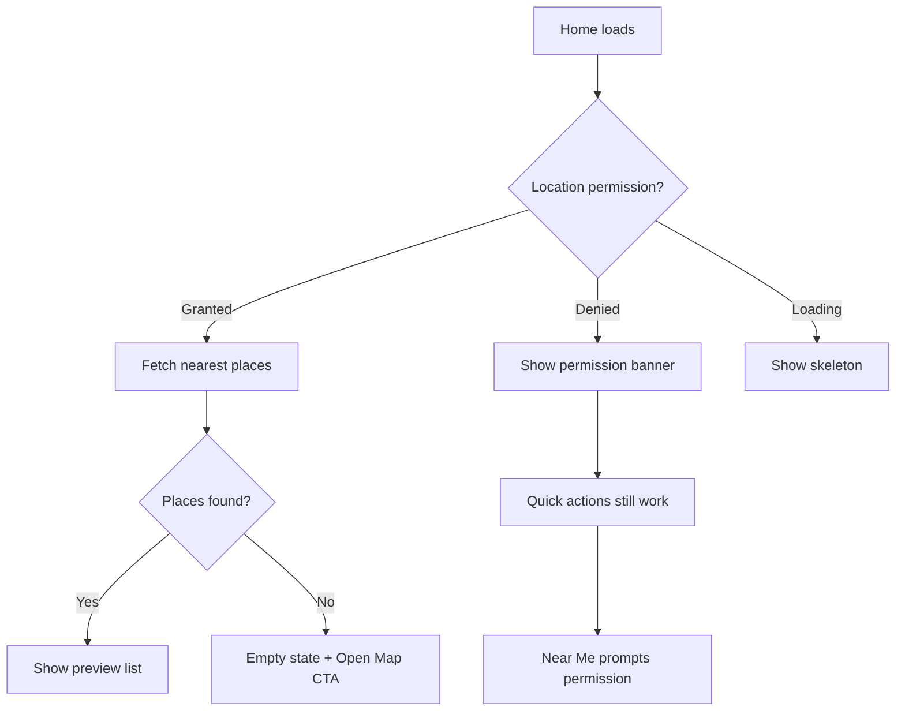

# S1 — Home Screen Design

**Sprint 1 · Epic E3 Place Discovery · Design spec · Owner TBD**

As a user, I land on a useful home screen that surfaces nearby accessible places and quick paths into the map, so I can start exploring without hunting through tabs.

## Context

Wayble is an **Inclusive Public Space Accessibility Mapper**. After onboarding or sign-in, users arrive at the **Home tab** (`apps/mobile/app/(tabs)/home/index.tsx`). Today that screen is a placeholder — title, subtitle, and a debug button only.

The **Map tab** (`apps/mobile/app/(tabs)/mapbox/index.tsx`) already delivers the core product experience: Mapbox map, nearby places, search, category filters, bottom sheet, and screen-reader list mode. Home should act as a **dashboard and entry point**, not a duplicate of the map.

**Existing assets to align with:**

| Asset                      | Path                                                              |
| -------------------------- | ----------------------------------------------------------------- |
| Design tokens              | `apps/mobile/constants/theme.ts`                                  |
| UI primitives              | `apps/mobile/components/ui/` (`AppText`, `Screen`, `TouchTarget`) |
| Onboarding visual language | `apps/mobile/app/onboarding.tsx`                                  |
| Map list item              | `apps/mobile/components/map/PlaceListItem.tsx`                    |
| Category chips             | `apps/mobile/components/map/CategoryFilter.tsx`                   |
| Search bar                 | `apps/mobile/components/map/SearchBar.tsx`                        |
| Nearby places hook         | `apps/mobile/hooks/use-nearby-places.ts`                          |
| Place detail route         | `apps/mobile/app/place/[id].tsx`                                  |
| Current user query         | `packages/backend/convex/users.ts` → `currentUser`                |

**Brand reference:** Green primary (`#0B6B3A` light / `#8CE0A9` dark), soft background, onboarding slogan — _"Find a better way to get there."_

---

## Tab Roles

| Tab          | Role                                                           |
| ------------ | -------------------------------------------------------------- |
| **Home**     | Overview, discovery, quick actions — _"What's near me?"_       |
| **Map**      | Full map + list exploration — _"Show me everything on a map."_ |
| **Settings** | Account, permissions, preferences                              |

---

## Design Principles

1. **Reuse, don't reinvent** — Extend existing components and tokens; Home should feel like onboarding and Map belong to the same app.
2. **Action-first** — Every section should lead somewhere useful within one tap.
3. **Accessible by default** — 44pt touch targets, combined screen-reader labels, Dynamic Type, light/dark support.
4. **Delegate depth to Map** — Home previews and shortcuts; Map handles full search, filters, and exploration.
5. **Auth-aware** — Guest users can explore; authenticated users see personalization and contribution prompts.

---

## Screen Layout

Top-to-bottom scroll structure:

```text
┌─────────────────────────────────────┐
│  [Logo]  Good morning, Alex    [👤] │  ← Header (personalized or generic)
│  Find a better way to get there.    │  ← Subtle slogan (textMuted)
├─────────────────────────────────────┤
│  🔍 Search accessible places...     │  ← Search entry (tap → Map)
├─────────────────────────────────────┤
│  Quick actions                      │
│  ┌──────────┐ ┌──────────┐          │
│  │ Open Map │ │ Near Me  │          │  ← Two primary CTAs
│  └──────────┘ └──────────┘          │
├─────────────────────────────────────┤
│  Browse by need                     │
│  [♿ Wheelchair] [🛗 Elevator] ...  │  ← Horizontal category chips
├─────────────────────────────────────┤
│  Nearby accessible places    See all│  ← Section header + link to Map
│  ┌─────────────────────────────┐    │
│  │ ● City Mall        0.8 km   │    │  ← PlaceListItem (max 3–5)
│  │ ● Central Library  1.2 km   │    │
│  │ ● Metro Station    2.1 km   │    │
│  └─────────────────────────────┘    │
├─────────────────────────────────────┤
│  [Guest banner OR Contribute CTA]   │  ← Auth-aware footer card
└─────────────────────────────────────┘
```

### State flow



---

## Section Specifications

### 1. Header

| Element           | Behavior                                                                                                |
| ----------------- | ------------------------------------------------------------------------------------------------------- |
| Small Wayble icon | 32×32, from `assets/images/app-icon/wayble-app-icon.png`                                                |
| Greeting          | Authenticated: time-aware greeting + `displayName` from `users.currentUser`; Guest: "Welcome to Wayble" |
| Profile shortcut  | Optional tap target → Settings tab                                                                      |

**Visual:** No heavy navigation bar. Content starts below safe area, consistent with onboarding. Optional ambient glow at top using `colors.primary` at 10% (light) / 18% (dark) opacity — same pattern as `onboarding.tsx`.

**Typography:**

- Greeting: `AppText` variant `title`
- Slogan: `body` with `textMuted` color

---

### 2. Search Entry

- Reuse `SearchBar` styling from the Map tab.
- On Home: **read-only** — tapping navigates to Map with search focused.
- Placeholder: "Search accessible places…"
- Route: `/mapbox?focusSearch=true` (query param to be supported by Map tab).

**Accessibility:**

- `accessibilityRole="button"`
- `accessibilityLabel="Search accessible places"`
- `accessibilityHint="Opens map search"`

---

### 3. Quick Actions

Two side-by-side action cards:

| Action    | Label    | Icon suggestion    | Destination                         |
| --------- | -------- | ------------------ | ----------------------------------- |
| Primary   | Open Map | Map pin            | `/mapbox`                           |
| Secondary | Near Me  | Location crosshair | `/mapbox` + center on user location |

**Style:**

- Background: `surface`
- Border: hairline `border`
- Radius: `radii.md`
- Icon accent: `primary`
- Min height: 44pt touch target (via `TouchTarget`)

---

### 4. Category Shortcuts

**Section title:** "Browse by need"

- Reuse chip styling from `CategoryFilter.tsx` (`CATEGORY_LABELS`, `CATEGORY_COLORS`, emojis).
- On Home: single-select — tap navigates to Map with category pre-filtered.
- Categories: Wheelchair, Elevator, Accessible Bathroom, Multiple Features.
- Route: `/mapbox?category=wheelchair` (etc.)

Exclude the "All places" chip on Home — that is the Map default.

---

### 5. Nearby Places Preview

**Section header:** "Nearby accessible places" + trailing "See all" link → `/mapbox`

**Data:** `useNearbyPlaces()` limited to top 3–5 results by distance.

**UI:** Reuse `PlaceListItem` inside a rounded `surface` container (`radii.md`, subtle border).

**Tap behavior:** Navigate to `/place/[id]` (existing full detail screen).

| State           | UX                                                                                                    |
| --------------- | ----------------------------------------------------------------------------------------------------- |
| Loading         | Skeleton rows or centered `ActivityIndicator`                                                         |
| Location denied | Inline banner: "Enable location to see nearby places" + action to request permission or open Settings |
| No places       | "No places found nearby. Explore the map to discover more." + Open Map CTA                            |
| Error / offline | "Unable to load places. Check your connection." + retry via pull-to-refresh                           |

**Pull-to-refresh:** Refresh location and re-fetch nearby query (Phase 2).

---

### 6. Bottom Card (Auth-aware)

| User state        | Content                                                                            |
| ----------------- | ---------------------------------------------------------------------------------- |
| **Guest**         | "Sign up to contribute accessibility reports" + primary "Get Started" → `/sign-up` |
| **Authenticated** | "Help the community" + "Add a report" → Map tab (future: dedicated report flow)    |

**Style:** Card on `surface` with pill-style layout, echoing onboarding feature badges.

---

## Visual Style Guide

### Colors (from `theme.ts`)

| Use                      | Token                                       |
| ------------------------ | ------------------------------------------- |
| Screen background        | `background`                                |
| Cards, list container    | `surface`                                   |
| Primary buttons, accents | `primary` / `onPrimary`                     |
| Body text                | `text`                                      |
| Secondary text, slogans  | `textMuted`                                 |
| Borders                  | `border` (hairline)                         |
| Category indicators      | `CATEGORY_COLORS` from `CategoryFilter.tsx` |
| Focus ring               | `focus`                                     |

### Spacing & radii

| Use                       | Token                                 |
| ------------------------- | ------------------------------------- |
| Screen horizontal padding | `spacing.lg` (via `Screen` component) |
| Gap between sections      | `spacing.xl`                          |
| Card internal padding     | `spacing.md`                          |
| Chip / item gap           | `spacing.sm`                          |
| Card corner radius        | `radii.md`                            |
| Pill elements             | `radii.pill`                          |

### Typography

| Element                | Variant                                           |
| ---------------------- | ------------------------------------------------- |
| Greeting               | `title`                                           |
| Section headers        | `label`                                           |
| Body copy              | `body`                                            |
| Emphasis / place names | `bodyStrong`                                      |
| Large hero (if used)   | `display` — avoid on Home; reserve for onboarding |

---

## Accessibility Checklist

- [ ] Screen announced on focus: "Wayble home"
- [ ] Greeting uses `accessibilityRole="header"`
- [ ] Search entry is a single accessible button with hint
- [ ] Quick action cards have distinct labels: "Open map", "Show places near me"
- [ ] Category chips reuse Map tab labels for consistency
- [ ] Place rows use combined `accessibilityLabel` (already in `PlaceListItem`)
- [ ] Guest / contribute card is one accessible region
- [ ] Logical focus order: top → bottom, left → right
- [ ] All interactive elements meet 44×44pt minimum (`TouchTarget`)
- [ ] Contrast meets WCAG AA (tokens already designed for this in S0-4)
- [ ] Works in light and dark mode via `useAppTheme()`

---

## Component Plan

### New components

| Component           | Location (proposed)                     | Purpose                                          |
| ------------------- | --------------------------------------- | ------------------------------------------------ |
| `HomeHeader`        | `components/home/HomeHeader.tsx`        | Greeting, logo, optional profile link            |
| `QuickActionCard`   | `components/home/QuickActionCard.tsx`   | Reusable action tile (icon + label)              |
| `SectionHeader`     | `components/home/SectionHeader.tsx`     | Title + optional trailing action                 |
| `HomeNearbySection` | `components/home/HomeNearbySection.tsx` | List wrapper with loading / empty / error states |
| `GuestPromptCard`   | `components/home/GuestPromptCard.tsx`   | Sign-up CTA for guests                           |
| `ContributeCard`    | `components/home/ContributeCard.tsx`    | Report CTA for authenticated users               |

### Reuse as-is

- `Screen`, `AppText`, `TouchTarget`
- `PlaceListItem`
- `SearchBar` (read-only variant or `editable={false}` prop)
- Category chip rendering logic from `CategoryFilter`
- `LocationPermissionBanner` (from Map components, if suitable)

---

## Data & Navigation

### Data sources

| Data          | Source                                |
| ------------- | ------------------------------------- |
| Current user  | `useQuery(api.users.currentUser)`     |
| Nearby places | `useNearbyPlaces()` — limit 5 on Home |
| Location      | `useLocationPermission()`             |

### Routes

| Action                | Route                         |
| --------------------- | ----------------------------- |
| Place detail          | `/place/[id]`                 |
| Map (default)         | `/mapbox`                     |
| Map + category filter | `/mapbox?category=wheelchair` |
| Map + search focus    | `/mapbox?focusSearch=true`    |
| Sign up               | `/sign-up`                    |
| Settings              | `/settings` (tab)             |

### Map tab coordination

Home deep-links into Map via query params. Map tab should read optional params on mount:

- `category` — pre-select category filter
- `focusSearch=true` — focus search input

This coordination is a small Map tab change, not a backend change.

---

## Implementation Phases

### Phase 1 — Structure (MVP)

Replace the placeholder in `apps/mobile/app/(tabs)/home/index.tsx`:

1. Scroll layout with `Screen` wrapper
2. `HomeHeader` with guest / authenticated greeting
3. Read-only search entry → Map
4. Two quick action cards
5. Nearby preview (3 items) using `useNearbyPlaces` + `PlaceListItem`
6. "See all" link → Map

**Deliverable:** Usable Home that surfaces real Convex data.

### Phase 2 — Polish

1. Category shortcut chips with Map deep-links
2. Guest prompt / contribute cards
3. Location permission banner in nearby section
4. Pull-to-refresh
5. Ambient glow decoration (onboarding-style)
6. Map tab support for `?category` and `?focusSearch` query params

**Deliverable:** Feature-complete Home aligned with onboarding visual language.

### Phase 3 — Enhancements (future)

- Recently viewed places (local storage)
- "Recently updated" section using `lastReportedAt` from `getPlace`
- Saved / preferred category shortcuts
- Mini static map preview thumbnail
- Time-of-day personalized greeting refinement

---

## Out of Scope

- Full map embed on Home (belongs on Map tab)
- Full search / filter logic duplicated on Home
- New backend queries (existing `places.nearest` and `users.currentUser` are sufficient for Phase 1–2)
- Debug tools on Home (keep debug at `/debug` or dev-only entry in Settings)
- Persisted user theme override
- "Add report" full flow (link to Map until report UI exists)

---

## Success Criteria

Home is complete when a user can:

1. See a personalized welcome (or guest equivalent) on landing
2. Open search or the full map in one tap
3. Browse by accessibility need via category shortcuts (Phase 2)
4. View 3–5 nearby places and open place details
5. Understand how to sign up and contribute (guest) or add a report (authenticated)
6. Use the screen comfortably with VoiceOver / TalkBack and in dark mode

---

## Open Questions

| Question                               | Recommendation                                                      |
| -------------------------------------- | ------------------------------------------------------------------- |
| Should Home show the debug button?     | No — remove from production Home; keep `/debug` reachable elsewhere |
| Profile shortcut vs Settings tab only? | Optional shortcut in header; Settings tab remains canonical         |
| How many nearby places to show?        | 3 on small screens, up to 5 if space allows                         |
| Greeting time buckets?                 | Morning / afternoon / evening based on local time                   |

---

## Related Docs

- [S0-4 — Expo App Shell](./S0-4-expo-app-shell.md) — design tokens, tab shell, accessibility defaults
- [US-05 — View Place Attributes](./US-05-view-a-place-recorded-accessibility-attributes.md) — place detail screen Home links into
- [S1-US-01 — Sign Up and Log In](./S1-US-01-sign-up-and-log-in.md) — auth flows for guest prompt card
