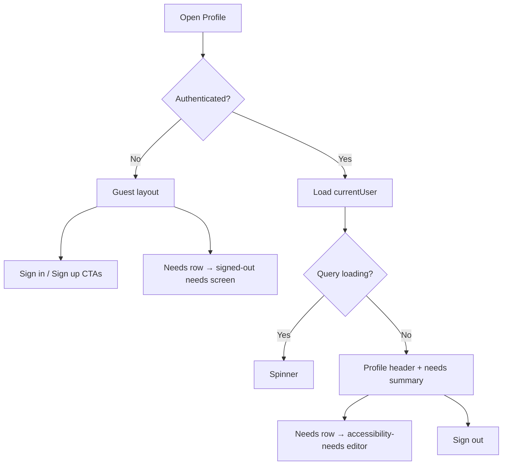

# S1 — Profile Section Design

**Sprint 1 · Epic E2 Identity / E6 Personalised Needs · Design spec · Owner TBD**

As a signed-in user, I can view and manage my identity and accessibility needs in one dedicated profile area, so the app feels personal and I can control what matters to me without digging through app settings.

## Context

Wayble is an **Inclusive Public Space Accessibility Mapper**. Users authenticate via Convex Auth (email + password). Profile data lives on the `users` table and is exposed through `users.currentUser` and `users.updateProfile`.

**Today:**

| Area                  | Location                           | What it does                             |
| --------------------- | ---------------------------------- | ---------------------------------------- |
| Account summary       | `settings/index.tsx`               | Read-only name, email, role + Sign Out   |
| Accessibility needs   | `settings/accessibility-needs.tsx` | Full needs editor (US-02, shipped)       |
| Home profile shortcut | `HomeHeader` → `/settings`         | Opens Settings tab, not a profile screen |

Profile and Settings are **merged** in the Settings tab. There is no dedicated Profile screen, no display-name editor, and no avatar UI — even though `displayName` and `avatarUrl` exist on the schema and `updateProfile` already accepts them.

**Existing assets to align with:**

| Asset                | Path                                                                              |
| -------------------- | --------------------------------------------------------------------------------- |
| Design tokens        | `apps/mobile/constants/theme.ts`                                                  |
| UI primitives        | `apps/mobile/components/ui/` (`AppText`, `Screen`, `TouchTarget`, `CheckboxRow`)  |
| Symbols              | `apps/mobile/components/ui/app-symbol.tsx`                                        |
| Home visual language | `docs/plans/S1-home-screen-design.md`, `components/home/`                         |
| Needs editor         | `settings/accessibility-needs.tsx`, `components/profile/NeedsCategorySection.tsx` |
| Attribute metadata   | `constants/accessibility-metadata.ts`                                             |
| Backend profile API  | `packages/backend/convex/users.ts` → `currentUser`, `updateProfile`               |
| Auth flows           | `docs/plans/S1-US-01-sign-up-and-log-in.md`                                       |

**Brand reference:** Green primary (`#0B6B3A` light / `#8CE0A9` dark), soft background, onboarding slogan — _"Find a better way to get there."_

---

## Profile vs Settings

Split responsibilities so users know where to go:

| Area         | Role                        | Examples                                                                       |
| ------------ | --------------------------- | ------------------------------------------------------------------------------ |
| **Profile**  | Who you are + what you need | Display name, avatar, accessibility needs, account email (read-only), sign out |
| **Settings** | How the app behaves         | Theme info, location permission, developer/debug tools                         |

Home header profile shortcut should open **Profile**, not Settings.

```text
Home ──profile icon──► Profile screen
Settings tab ────────► Settings screen (app preferences only)
Profile ──link──────► Accessibility needs (existing sub-screen)
Profile ──link──────► Settings (optional footer link)
```

---

## Design Principles

1. **Identity first** — Profile leads with the user's name and avatar, not technical fields like role.
2. **Reuse US-02** — Accessibility needs editor already exists; Profile links into it, does not duplicate it.
3. **Immediate feedback** — Edits that can save inline (display name) use optimistic updates, matching the needs screen.
4. **Guest-aware** — Guests see a clear sign-in prompt; authenticated users see full profile.
5. **Accessible by default** — 44pt touch targets, labels on all actions, Dynamic Type, light/dark support.
6. **No over-scoping** — Email change, password reset, OAuth, and avatar upload to storage are future stories.

---

## Information Architecture

```text
Profile (new: settings/profile.tsx or profile/index.tsx)
├── Profile header (avatar + display name + email)
├── Accessibility needs row → /settings/accessibility-needs
├── Account actions
│   ├── Sign out (authenticated)
│   └── Sign in / Create account (guest)
└── Optional: "App settings" link → Settings tab

Settings (existing: settings/index.tsx — slimmed down)
├── Theme
├── Location
└── Developer (debug)
```

**Route recommendation:** Keep everything under the Settings stack for minimal router churn:

| Screen              | Route                           | Stack title         |
| ------------------- | ------------------------------- | ------------------- |
| Profile             | `/settings/profile`             | Profile             |
| Accessibility needs | `/settings/accessibility-needs` | Accessibility Needs |
| Settings hub        | `/settings` (tab)               | Settings            |

Update `HomeHeader` profile shortcut: `router.push("/settings/profile")`.

---

## Screen Layout — Profile

Top-to-bottom scroll structure:

```text
┌─────────────────────────────────────┐
│  ← Back (stack)        Profile      │  ← Stack header (or hidden + in-screen title)
├─────────────────────────────────────┤
│         ┌─────────┐                 │
│         │  Avatar │                 │  ← 80×80 circle; initials fallback
│         └─────────┘                 │
│         Alex Kumar                  │  ← displayName (editable Phase 2)
│         alex@example.com            │  ← email, read-only, textMuted
├─────────────────────────────────────┤
│  My accessibility needs        ›    │  ← Nav row; subtitle: "3 needs selected"
├─────────────────────────────────────┤
│  ┌─────────────────────────────┐    │
│  │  Mobility · 2 selected      │    │  ← Optional preview chips (Phase 2)
│  │  ♿ Step-free entrance       │    │     Top 3 needs as read-only summary
│  │  🛗 Elevator                │    │
│  └─────────────────────────────┘    │
├─────────────────────────────────────┤
│  [ Sign Out ]                       │  ← Danger-outline button (auth only)
├─────────────────────────────────────┤
│  App settings                    ›    │  ← Link to /settings (Phase 2)
└─────────────────────────────────────┘
```

### Guest state

```text
┌─────────────────────────────────────┐
│         ┌─────────┐                 │
│         │  👤     │                 │  ← Generic symbol avatar
│         └─────────┘                 │
│         Guest                       │
│         Sign in to save your profile│
├─────────────────────────────────────┤
│  My accessibility needs        ›    │  ← Opens needs screen → signed-out state
├─────────────────────────────────────┤
│  [ Sign In ]                        │  ← Primary → /sign-in
│  [ Create Account ]                 │  ← Secondary → /sign-up
└─────────────────────────────────────┘
```

---

## Section Specifications

### 1. Profile Header

| Element      | Behavior                                                                                                                           |
| ------------ | ---------------------------------------------------------------------------------------------------------------------------------- |
| Avatar       | 80×80 circle. If `avatarUrl` set → `Image`. Else → initials from `displayName` or `name` on `primary`-tinted `surface` background. |
| Display name | `displayName \|\| name \|\| "User"`. Phase 1: read-only. Phase 2: tap to edit inline or navigate to edit sheet.                    |
| Email        | Read-only from `currentUser.email`. Hidden line if missing. Never editable in Phase 1–2.                                           |
| Role         | **Do not show** in Profile UI (internal field; already removed from user-facing copy in favour of identity).                       |

**Visual:** Centred column, `spacing.xl` below safe area. Optional subtle ambient glow at top (same pattern as Home).

**Typography:**

- Name: `AppText` variant `title`, centred
- Email: `body`, `textMuted`, centred

---

### 2. Accessibility Needs Row

Reuse the Settings nav-card pattern already on `settings/index.tsx`:

| State               | Subtitle                    |
| ------------------- | --------------------------- |
| Guest               | "Sign in to set your needs" |
| Auth, none selected | "Not set yet"               |
| Auth, N selected    | "N need(s) selected"        |

- Tap → `/settings/accessibility-needs` (existing screen)
- `accessibilityRole="button"` with combined label: _"Accessibility needs. 3 needs selected. Opens editor."_

Phase 2 optional preview card below the row: show up to 3 selected need labels from `ATTRIBUTE_METADATA` (read-only, not tappable individually).

---

### 3. Account Actions

| User state        | Actions                                                     |
| ----------------- | ----------------------------------------------------------- |
| **Authenticated** | Sign Out (danger outline, same styling as current Settings) |
| **Guest**         | Sign In (primary) + Create Account (secondary outline)      |

Sign Out behaviour unchanged: `signOut()` → `router.replace("/sign-in")`.

---

### 4. App Settings Link (Phase 2)

Footer nav row: "App settings ›" → `/settings` (Settings tab index).

Keeps Profile focused on identity; power users still reach theme/location/debug from Settings tab or this link.

---

## Settings Tab Refactor (Phase 1)

Remove from `settings/index.tsx` and move to Profile:

- Account card (name, email, role, sign out)
- Accessibility needs entry card

Settings tab becomes:

```text
Settings
├── Theme (read-only, follows device)
├── Location (status + Open OS Settings)
└── Developer (debug screen button)
```

Add Profile entry at top of Settings (Phase 1) so tab users can reach Profile before Home shortcut is wired:

```text
Profile                          ›
Manage your account and needs
```

---

## Visual Style Guide

Match Home and Settings card patterns.

### Colors (from `theme.ts`)

| Use                        | Token                    |
| -------------------------- | ------------------------ |
| Screen background          | `background`             |
| Cards, avatar ring         | `surface`                |
| Avatar initials background | `primary` at 15% opacity |
| Avatar initials text       | `primary`                |
| Primary buttons            | `primary` / `onPrimary`  |
| Sign out                   | `danger`                 |
| Secondary text             | `textMuted`              |
| Borders                    | `border` (hairline)      |

### Spacing & radii

| Use                       | Token               |
| ------------------------- | ------------------- |
| Screen horizontal padding | `spacing.lg`        |
| Section gap               | `spacing.xl`        |
| Card padding              | `spacing.lg`        |
| Avatar size               | 80×80, `radii.pill` |
| Card corner radius        | `radii.md`          |

### Typography

| Element                      | Variant              |
| ---------------------------- | -------------------- |
| Screen title (if in-content) | `title`              |
| Display name                 | `title`              |
| Email, subtitles             | `body` + `textMuted` |
| Nav row title                | `label`              |
| Nav row subtitle             | `body` + `textMuted` |

### Icons

Use `AppSymbol` (expo-symbols), not emoji in text:

| Use                    | Symbol                                        |
| ---------------------- | --------------------------------------------- |
| Generic avatar (guest) | `person.circle.fill` / `person`               |
| Nav chevron            | Text `›` or `chevron.right` symbol            |
| Needs row              | `figure.roll` or `accessibility` if available |

---

## State Flow



---

## Data & Navigation

### Data sources

| Data                | Source                                                        |
| ------------------- | ------------------------------------------------------------- |
| Current user        | `useQuery(api.users.currentUser)`                             |
| Update display name | `useMutation(api.users.updateProfile)` — `{ displayName }`    |
| Accessibility needs | Already on `currentUser.accessibilityNeeds`; editor unchanged |

### Routes

| Action              | Route                           |
| ------------------- | ------------------------------- |
| Profile             | `/settings/profile`             |
| Accessibility needs | `/settings/accessibility-needs` |
| Settings hub        | `/settings`                     |
| Sign in             | `/sign-in`                      |
| Sign up             | `/sign-up`                      |
| From Home header    | `/settings/profile`             |

No new backend queries required for Phase 1–2.

---

## Component Plan

### New components

| Component            | Location                                    | Purpose                                                      |
| -------------------- | ------------------------------------------- | ------------------------------------------------------------ |
| `ProfileHeader`      | `components/profile/ProfileHeader.tsx`      | Avatar, name, email                                          |
| `ProfileAvatar`      | `components/profile/ProfileAvatar.tsx`      | Image or initials circle                                     |
| `ProfileNavRow`      | `components/profile/ProfileNavRow.tsx`      | Reusable settings-style nav row (title + subtitle + chevron) |
| `NeedsSummaryCard`   | `components/profile/NeedsSummaryCard.tsx`   | Optional read-only preview of selected needs (Phase 2)       |
| `GuestProfilePrompt` | `components/profile/GuestProfilePrompt.tsx` | Sign-in CTAs for unauthenticated state                       |

### Reuse as-is

- `Screen`, `AppText`, `TouchTarget`, `AppSymbol`
- `NeedsCategorySection` (on accessibility-needs screen only)
- Settings card styles from `settings/index.tsx` (extract shared `SettingsCard` in Phase 2 if duplication grows)

### Screen files

| File                              | Action                                              |
| --------------------------------- | --------------------------------------------------- |
| `app/(tabs)/settings/profile.tsx` | **NEW** — Profile screen                            |
| `app/(tabs)/settings/index.tsx`   | **MODIFY** — Slim to app settings; add Profile link |
| `app/(tabs)/settings/_layout.tsx` | **MODIFY** — Register `profile` route               |
| `components/home/HomeHeader.tsx`  | **MODIFY** — Link to `/settings/profile`            |

---

## Accessibility Checklist

- [ ] Profile screen announced: "Profile"
- [ ] Avatar has `accessibilityLabel`: "Profile photo for Alex" or "Default profile avatar"
- [ ] Display name uses `accessibilityRole="header"`
- [ ] Email read as static text, not editable hint
- [ ] Needs nav row is one button with title + status in `accessibilityLabel`
- [ ] Sign out / sign in buttons have distinct labels and hints
- [ ] Guest state does not expose empty editable fields
- [ ] All touch targets ≥ 44×44pt
- [ ] Works in light and dark mode
- [ ] Dynamic Type: name and email wrap without clipping avatar layout

---

## Implementation Phases

### Phase 1 — Profile screen (MVP)

1. Add `settings/profile.tsx` with authenticated + guest layouts
2. `ProfileHeader` with initials avatar (no upload)
3. Needs nav row (reuse summary logic from Settings index)
4. Sign out / sign in actions
5. Slim down Settings index; add Profile link card at top
6. Update Home header shortcut → Profile
7. Register route in `_layout.tsx`

**Deliverable:** Dedicated Profile reachable from Home and Settings; Settings focused on app prefs.

### Phase 2 — Edit & preview

1. Inline or sheet editor for `displayName` via `updateProfile` with optimistic update
2. `NeedsSummaryCard` — top 3 selected needs preview on Profile
3. "App settings" footer link on Profile
4. Extract shared `ProfileNavRow` / `SettingsCard` if duplicated

**Deliverable:** Users can update their display name; Profile shows needs preview.

### Phase 3 — Enhancements (future)

- Avatar upload via Convex storage → `avatarUrl`
- Password change / reset flow
- OAuth account linking (Google, Apple)
- Contribution stats ("12 reports submitted")
- "Matches my profile" badge on Home/Map when US-04 ships

---

## Out of Scope

- Email or password editing
- Avatar camera/gallery picker and storage upload (Phase 3)
- Duplicating the full accessibility needs editor on Profile
- Role management or admin UI
- Public profile pages / social features
- Persisted in-app theme override (Settings stays read-only for theme)

---

## Success Criteria

Profile is complete when a user can:

1. Open Profile from the Home header in one tap
2. See their name, email, and avatar (or initials fallback) when signed in
3. Navigate to accessibility needs editing from Profile
4. Sign out (or sign in / sign up when guest) from Profile
5. Find app-level settings (theme, location, debug) on the Settings tab without account clutter
6. Use the screen comfortably with VoiceOver / TalkBack and in dark mode

---

## Open Questions

| Question                                          | Recommendation                                                      |
| ------------------------------------------------- | ------------------------------------------------------------------- |
| Profile as stack screen vs new tab?               | Stack screen under Settings — fewer tab-bar changes                 |
| Show role (`member`, `admin`) anywhere?           | No — keep internal unless admin tooling ships                       |
| Edit display name inline vs separate screen?      | Inline field or bottom sheet in Phase 2; avoid new route            |
| Keep accessibility-needs under `/settings/` path? | Yes — avoids route migration; Profile is the entry point            |
| Rename Settings tab to "More"?                    | No for now — Settings remains familiar; Profile is the identity hub |

---

## Related Docs

- [S1 — Home Screen Design](./S1-home-screen-design.md) — Home header profile shortcut
- [US-02 — Set My Accessibility Needs](./US-02-set-my-accessibility-needs-in-my-profile.md) — Needs editor (shipped)
- [S1-US-01 — Sign Up and Log In](./S1-US-01-sign-up-and-log-in.md) — Auth flows for guest state
- [S0-5 — Entity Model](./S0-5-entity-model-accessibility-taxonomy.md) — `users` table fields
- [S0-4 — Expo App Shell](./S0-4-expo-app-shell.md) — Tokens, tab shell, accessibility defaults
