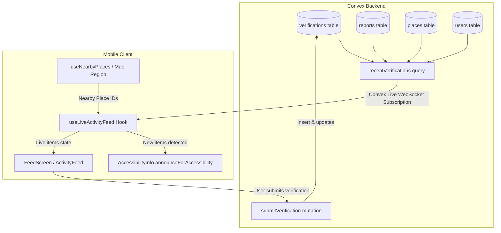

# S3-7: Live Activity Feed of Nearby Verifications (US-23)

**Sprint 3 · Live Community Feed & Accessibility Verification · Owner: Fullstack**

As a user navigating or exploring an area, I can see a real-time live activity feed of nearby accessibility verifications submitted by the community, so I have up-to-the-minute trust and situational awareness without manual refreshing.

---

## 1. Context & Objectives

Wayble enables crowdsourced accessibility verification for public spaces. When members or local volunteers verify accessibility features (e.g. ramps, elevators, accessible restrooms), other nearby users need to immediately see these verification events reflected in real-time.

### Requirements & Sub-tasks

1. **Backend Query**: Create `recentVerifications(placeId, placeIds, limit)` in [verifications.ts](file:///c:/Users/aaththika_i/Desktop/Wayble/packages/backend/convex/verifications.ts).
2. **Real-time Subscription**: Use Convex `useQuery` for automatic reactive live streaming (no manual polling or pull-to-refresh needed).
3. **Map Region Scoping**: Filter feed items by nearby place IDs matching the user's active viewport/location.
4. **Screen Reader Accessibility**: Announce incoming live feed items using `AccessibilityInfo.announceForAccessibility`.
5. **Feed UI**: Build `FeedScreen` and reusable feed components showing:
   - Verifier profile (name/avatar/role badge)
   - Verified place and attribute
   - Timestamp (relative formatting)
   - Confidence badge (e.g., Confirmed, High Confidence, Under Review)
   - Verdict ("confirm" vs "dispute") and optional note
   - Quick verification submission sheet/action for fast two-device demo testing.
6. **Two-Device Live Verification Flow**: Multi-device verification demo test protocol where a verification posted on Device A immediately appears on Device B.

---

## 2. Architecture & Data Flow

---

## 3. Detailed Technical Plan

### A. Backend (`packages/backend/convex/`)

#### 1. [NEW] [verifications.ts](file:///c:/Users/aaththika_i/Desktop/Wayble/packages/backend/convex/verifications.ts)

- **`recentVerifications` query**:
  - **Args**:
    - `placeId?: v.optional(v.id("places"))`
    - `placeIds?: v.optional(v.array(v.id("places")))`
    - `limit?: v.optional(v.number())` (default 20, max 100)
  - **Handler**:
    - Fetches recent verifications.
    - If `placeId` is provided, filters to verifications for reports linked to `placeId`.
    - If `placeIds` is provided, filters to verifications for reports belonging to those places.
    - If neither is provided, fetches the most recent verifications globally across the database.
    - Enriches each record with:
      - `place`: Name, Category, Address, Location
      - `verifier`: Display name, avatar, role
      - `attributes`: Verified attributes from the linked report
      - `verdict`: `"confirm"` | `"dispute"`
      - `confidenceScore` & `confidenceBadge`: Derived based on ratio of confirmations to disputes and total verification volume
      - `updatedAt`: Millisecond timestamp
- **`submitVerification` mutation**:
  - **Args**:
    - `reportId: v.id("reports")`
    - `verdict: v.union(v.literal("confirm"), v.literal("dispute"))`
    - `note?: v.optional(v.string())`
  - Authenticates user (or uses guest/seed author fallback for test workflows).
  - Inserts/updates `verifications` record and touches `updatedAt`.
- **`submitPlaceVerification` mutation**:
  - Convenience mutation to verify a place directly by `placeId` (locates the active report or generates a demo report if missing, then inserts the verification).

#### 2. [NEW] [testing/verifications.test.ts](file:///c:/Users/aaththika_i/Desktop/Wayble/packages/backend/convex/testing/verifications.test.ts)

- Unit tests using `convex-test` & `vitest`:
  - `recentVerifications` returns properly enriched feed items.
  - `placeId` and `placeIds` filtering correctly scopes feed items.
  - Submitting a verification immediately appears in `recentVerifications`.
  - Confidence calculation accurately classifies badges (e.g. "Community Confirmed", "High Confidence", "Disputed").

---

### B. Mobile Frontend (`apps/mobile/`)

#### 1. [NEW] [hooks/use-live-activity-feed.ts](file:///c:/Users/aaththika_i/Desktop/Wayble/apps/mobile/hooks/use-live-activity-feed.ts)

- Wrapper around Convex `useQuery(api.verifications.recentVerifications, ...)`.
- Subscribes to live updates.
- Compares new result set with previous render via `useRef`.
- If new verification arrives:
  - Triggers `AccessibilityInfo.announceForAccessibility("New verification: [User] [confirmed/disputed] [Place Name] [Attribute]")`.

#### 2. [NEW] Components

- [ConfidenceBadge.tsx](file:///c:/Users/aaththika_i/Desktop/Wayble/apps/mobile/components/feed/ConfidenceBadge.tsx):
  - Visual status pill with color-coding and icons (High Confidence, Confirmed, Under Review, Disputed).
- [FeedCard.tsx](file:///c:/Users/aaththika_i/Desktop/Wayble/apps/mobile/components/feed/FeedCard.tsx):
  - Card with verifier avatar, name, role badge, place link, attribute pill, verdict tag, relative time, and note.
  - Full accessibility labels and touch target to jump to place detail.
- [SubmitVerificationModal.tsx](file:///c:/Users/aaththika_i/Desktop/Wayble/apps/mobile/components/feed/SubmitVerificationModal.tsx):
  - Interactive sheet/modal allowing instant verification submission for two-device demo testing.

#### 3. [NEW] [app/feed.tsx](file:///c:/Users/aaththika_i/Desktop/Wayble/apps/mobile/app/feed.tsx) & Navigation Updates

- Full Activity Feed Screen:
  - Filter segmented control: "Nearby Region" vs "All Verifications".
  - Live WebSocket connection status indicator ("Live updates active").
  - Pull-to-refresh (as an optional gesture, while Convex maintains continuous live subscription).
  - Quick action to open verification submission modal.
- Connect Feed into:
  - Root `_layout.tsx` (`Stack.Screen name="feed"`)
  - Home screen quick actions & section banner (`apps/mobile/app/(tabs)/home/index.tsx`)

---

## 4. Manual Two-Device Demo Test Protocol

1. **Setup**:
   - Device 1 (or Simulator/Browser A): Open Wayble to the **Feed Screen** scoped to "Nearby".
   - Device 2 (or Simulator/Browser B): Open Wayble to the same place or open the verification submission modal.
2. **Action**:
   - On Device 2, select an accessibility attribute (e.g. "Step-free Entrance" at "Central Hospital"), choose "Confirm", type note "Ramp is clear and working", and tap **Submit Verification**.
3. **Verification**:
   - Observe Device 1 screen without touching or refreshing:
   - The new verification item animates/appears immediately at the top of the feed within ~100ms.
   - Screen reader / TalkBack announces the new verification event.
   - Confidence badge reflects updated status.

---

## 5. File Changes Summary

| Layer   | File                                                      | Action | Description                                                                  |
| :------ | :-------------------------------------------------------- | :----- | :--------------------------------------------------------------------------- |
| Backend | `packages/backend/convex/verifications.ts`                | NEW    | `recentVerifications` query, `submitVerification`, `submitPlaceVerification` |
| Backend | `packages/backend/convex/testing/verifications.test.ts`   | NEW    | Vitest test suite for verification queries/mutations                         |
| Mobile  | `apps/mobile/hooks/use-live-activity-feed.ts`             | NEW    | Reactive query subscription & a11y announcement hook                         |
| Mobile  | `apps/mobile/components/feed/ConfidenceBadge.tsx`         | NEW    | Confidence badge UI component                                                |
| Mobile  | `apps/mobile/components/feed/FeedCard.tsx`                | NEW    | Rich feed verification card component                                        |
| Mobile  | `apps/mobile/components/feed/SubmitVerificationModal.tsx` | NEW    | Verification submission modal for demo & contributions                       |
| Mobile  | `apps/mobile/app/feed.tsx`                                | NEW    | Dedicated Live Activity Feed Screen                                          |
| Mobile  | `apps/mobile/app/_layout.tsx`                             | MODIFY | Register `feed` route                                                        |
| Mobile  | `apps/mobile/app/(tabs)/home/index.tsx`                   | MODIFY | Add Activity Feed quick action and live verification preview                 |
